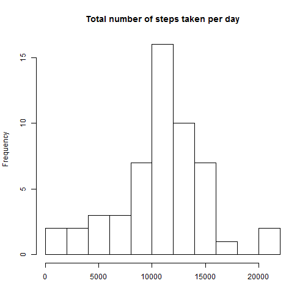
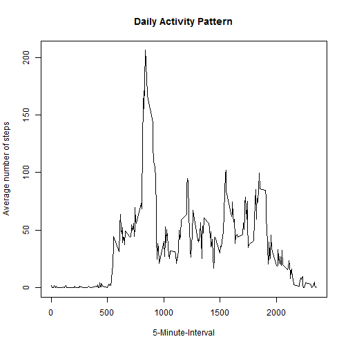
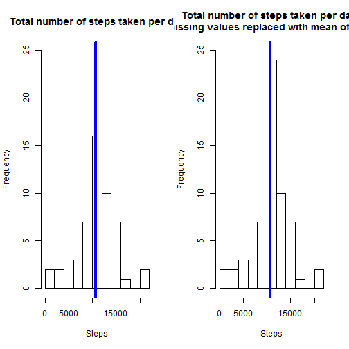
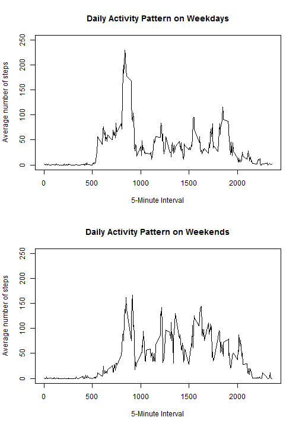

#  Reproducible Research: Peer Assessment 1

## Author: Karthikeyan Natarajan


## Loading and preprocessing the data

The data are compressed in a .zip file in the repository, so all we have to do is to uncompress and store them in a dataset in R. This is what is performed by the following code. A structure function is called on the dataset.


```r
filename <- unzip("activity.zip")
activity <- read.csv(filename, stringsAsFactors = FALSE)
str(activity)
```

```
## 'data.frame':	17568 obs. of  3 variables:
##  $ steps   : int  NA NA NA NA NA NA NA NA NA NA ...
##  $ date    : chr  "2012-10-01" "2012-10-01" "2012-10-01" "2012-10-01" ...
##  $ interval: int  0 5 10 15 20 25 30 35 40 45 ...
```

From the summary of the dataset we can see that the column containing the dates is not properly formatted to a Date class so we will adjust that now.


```r
activity$date <- as.Date(activity$date)
str(activity)
```

```
## 'data.frame':	17568 obs. of  3 variables:
##  $ steps   : int  NA NA NA NA NA NA NA NA NA NA ...
##  $ date    : Date, format: "2012-10-01" "2012-10-01" ...
##  $ interval: int  0 5 10 15 20 25 30 35 40 45 ...
```

We can also note that there are some missing values in the column of the steps, so let's count them.


```r
sum(is.na(activity$steps))
```

```
## [1] 2304
```

## What is mean total number of steps taken per day?

For the first two questions we will need a file that does not contain missing values.

We computed that there are 2304 missing values, that will be excluded temporarily from our analysis.

The dataset called "activity_rm" is created for this reason.


```r
activity_rm<-activity[which(!is.na(activity$steps)),]
```

The number of steps taken is measured in timeslots, 5-minute intervals, so in order to compute the total number of steps taken for each day we will aggregate the data by day.


```r
perday<-tapply(activity_rm$steps, activity_rm$date, sum)
```

So, now the per day dataset contains the total number of steps taken for each day of October and November (total 53 days).
Let's make a histogram of the total number of steps taken each day.


```r
hist(perday,10, main = "Total number of steps taken per day", xlab = "")
```

 

The mean total number of steps during a whole day is 1.0766 × 104, while the median of the total steps is 10765.


```r
mean(perday)
```

```
## [1] 10766.19
```


```r
median(perday)
```

```
## [1] 10765
```


## What is the average daily activity pattern?

In order to explore our data throughout the day, we will need to aggregate the dataset by the intervals. A per interval array is created for this reason and a time series plot will also be created.

Please keep in mind that the x-axis point labels are the names of the intervals in the dataset. The coding of the interval names is such, so that e.g. 500 should be conidered as 5:00 and 1000 as 10:00, ans so on. So, one can consider th x-axis as a fuull 24-hour-day starting from midnight and ending at the next midnight hour.


```r
dailyact<-tapply(activity_rm$steps, activity_rm$interval, mean)
plot(y = dailyact, x = names(dailyact), type = "l", xlab = "5-Minute-Interval", 
    main = "Daily Activity Pattern", ylab = "Average number of steps")
```

 

Finally, we find out that the interval with the maximum average number of steps throughout the days is 835 with 206.1698 steps.


```r
dailyact[dailyact==max(dailyact)]
```

```
##      835 
## 206.1698
```


## Inputing missing values

As discussed earlier in this report, there are a number os days/intervals where there are missing values (coded as NA). The presence of missing days may introduce bias into some calculations or summaries of the data.

Let's remind ourselves how many there were regarding the steps variable, and let's check that the other two variables do not have any missing data.


```r
sum(is.na(activity$steps))
```

```
## [1] 2304
```


```r
sum(is.na(activity))
```

```
## [1] 2304
```

The count of missing values for the column of steps equals to the total number missing in the whole dataset, so we can be sure that the intervals and the dates do not have any.

So, 2304 missing values is a percentage of 13.11% on the total observations, so obviously there will be some bias.

In order to exclude the bias we have to come up with a method for filling in all of the missing values in the dataset. Some quick ways are to use the mean/median for that day, or the mean for that 5-minute interval, etc.

We will go with the option of using the mean of the 5-minute interval, and thus we will now reate a new dataset that is equal to the original dataset but with the missing data filled in.


```r
act_new <- activity
act_new[which(is.na(act_new$steps)),1]<-
        dailyact[as.character(act_new[which(is.na(act_new$steps)),3])]
```

No missing values are now in the new dataset: 


```r
sum(is.na(act_new))
```

```
## [1] 0
```

Now let's make the same histogram, that we made in the first part of the analysis, in order to visually see if there is a big effect.


```r
perday_new<-tapply(act_new$steps, act_new$date, sum)
```


```r
par(mfrow=c(1,2))
hist(perday,10, main = "Total number of steps taken per day", xlab = "Steps"
     , ylim =c(0, 25))
abline(v = median(perday), col = 4, lwd = 4)
hist(perday_new,10, main = "Total number of steps taken per day  
     (missing values replaced with mean of interval)", xlab = "Steps",
     ylim =c(0, 25))
abline(v = median(perday_new), col = 4, lwd = 4)
```

 

We now calculate the median and the mean of the filled in dataset


```r
mean(perday_new)
```

```
## [1] 10766.19
```


```r
median(perday_new)
```

```
## [1] 10766.19
```

The impact of inputting missing data is minimal, as only the median seems to be changing but by just over one step.


```r
mean(perday_new)-mean(perday)
```

```
## [1] 0
```


```r
median(perday_new)-median(perday)
```

```
## [1] 1.188679
```


## Are there differences in activity patterns between weekdays and weekends?

In this part of the assigment, we will create factor variable in the dataset with two levels - "weekday" and "weekend" indicating whether a given date is a weekday or weekend day.


```r
act_new$wd<-weekdays(act_new$date)
act_new$fwd<- as.factor(c("weekend", "weekday"))
act_new[act_new$wd == "Sunday" | act_new$wd == "Saturday" ,5]<- factor("weekend")
act_new[!(act_new$wd == "Sunday" | act_new$wd == "Saturday"),5 ]<- factor("weekday")
```

Now we will create two aggregated arrays for the total number of steps taken per 5-minyute time interval for weekdays and weekends, and make a graph in order to compare it there is a difference.

Note that the plot has been created in the base system.


```r
act_new_we <- subset(act_new, fwd == "weekend") 
act_new_wd <- subset(act_new, fwd == "weekday") 
dailyact_we<-tapply(act_new_we$steps, act_new_we$interval, mean)
dailyact_wd<-tapply(act_new_wd$steps, act_new_wd$interval, mean)
par(mfrow=c(2,1))
plot(y = dailyact_wd, x = names(dailyact_wd), type = "l", xlab = "5-Minute Interval", 
     main = "Daily Activity Pattern on Weekdays", ylab = "Average number of steps", 
     ylim =c(0, 250))
plot(y = dailyact_we, x = names(dailyact_we), type = "l", xlab = "5-Minute Interval", 
     main = "Daily Activity Pattern on Weekends", ylab = "Average number of steps", 
     ylim =c(0, 250))
```

 

From the two graphs, we can clearly see that The plot indicates that the person moves around more (or more active) during the weekend days.

Please, once more, keep in mind that the x-axis point labels are the names of the intervals in the dataset. The coding of the interval names is such, so that e.g. 500 should be conidered as 5:00 and 1000 as 10:00, ans so on. So, one can consider th x-axis as a full 24-hour-day starting from midnight and ending at the next midnight hour.
